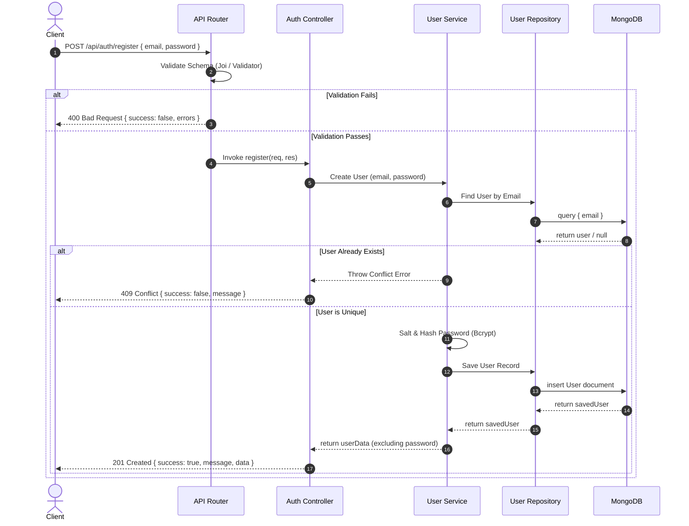
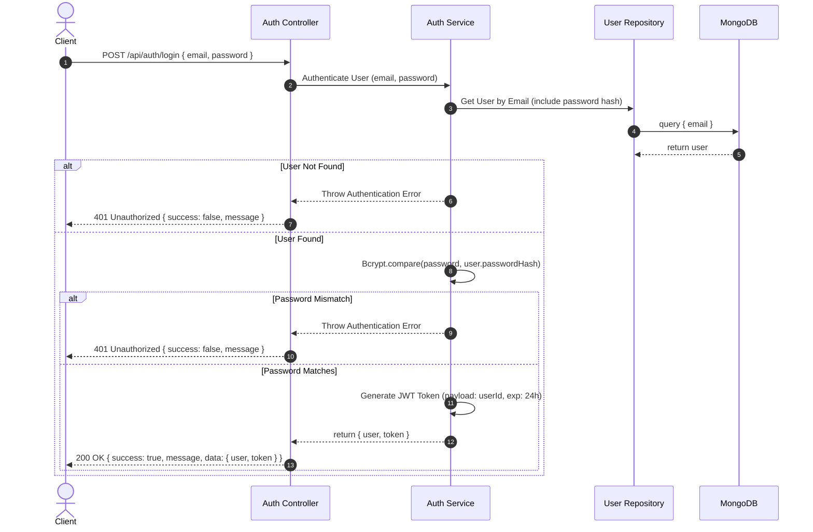
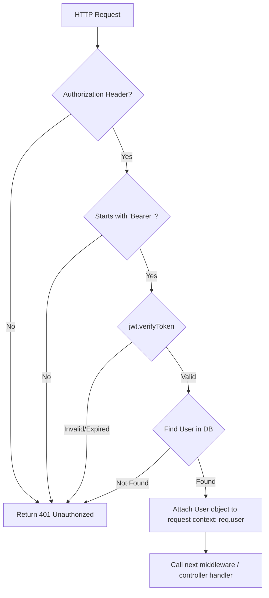

# Architectural Design Document: Authentication Module

This document outlines the software design, database schemas, flowcharts, security baselines, and validation rules for the **Shortly Authentication Module (Milestone 2)**. 

To keep the system lightweight, maintainable, and optimal for engineering interviews, this design focuses on a pure **Stateless JWT-based Authentication** system using **Node.js, Express, MongoDB (Mongoose), and Bcrypt**. Advanced configurations (such as OAuth, Password Reset, Email Verification, and 2FA) are explicitly deferred to Version 2.

---

## 1. Authentication Overview

Shortly utilizes a stateless authentication architecture. Rather than maintaining active sessions in a server-side database (which introduces latency and limits horizontal scaling), authentication state is encapsulated within a client-side **JSON Web Token (JWT)**.

```
┌──────────┐                 Credentials (POST)                ┌──────────┐
│  Client  │ ────────────────────────────────────────────────> │  Server  │
│ (Browser)│ <──────────────────────────────────────────────── │  (API)   │
└──────────┘                 Signed JWT Response               └──────────┘
     │                                                               │
     │                 Request + Bearer JWT (Headers)                │
     └───────────────────────────────────────────────────────────────┘
```

The system relies on:
1. **Passwords hashed with Bcrypt:** Ensuring password privacy.
2. **Stateless JWTs:** Exchanged via standard HTTP authorization headers (`Authorization: Bearer <token>`).
3. **Mongoose Middleware:** Hooking password salting and hashing directly to database save triggers.

---

## 2. Registration Flow

The registration flow captures new credentials, verifies email uniqueness, hashes the password, and creates a user entry.



---

## 3. Login Flow

The login flow authenticates existing users, signs a cryptographically secure token, and returns session access.



---

## 4. Logout Flow

Since Shortly uses a **stateless JWT strategy**, the server does not store active session records. Therefore, logging out is primarily a client-side memory cleanup operation:

1. **Client Action:** The client application clears the JWT token from storage (e.g., `localStorage.removeItem('token')` or runtime memory).
2. **Server Action:** No server communication is strictly required. For enhanced security or V2 roadmap audits, a token blacklist cache (stored in Redis) can be introduced. However, in Phase 1, client-side token discard satisfies the logout gate.

---

## 5. Protected Route Flow

Routes that manage links or display user-specific metrics require a valid token validation interceptor.



---

## 6. JWT Strategy

Shortly implements a stateless token strategy:

- **Token Payload:** To minimize payload bloat, the token signature includes only the user's primary identifier and issue timestamps:
  ```json
  {
    "userId": "6693a4b8c87cb395a3105b2c",
    "iat": 1784008000,
    "exp": 1784086400
  }
  ```
- **Signing Algorithm:** `HS256` (HMAC SHA-256) utilizing a minimum 32-character key loaded via `process.env.JWT_SECRET`.
- **Token Expiry:** Configured to a strict **24 hours** (`24h`), establishing a balance between session user convenience and token compromise windows.

---

## 7. Password Hashing Strategy

Passwords must never be stored, handled, or exposed in plaintext.
- **Library:** `bcryptjs` (to guarantee consistent compilation across target platforms without native build compilation errors).
- **Salt Rounds:** **10 rounds** (optimizing server CPU compute time against brute-force resistance. 10 rounds takes $\approx 50\text{-}80\text{ms}$ on standard servers).
- **Automation:** Implemented as a Mongoose pre-save hook. If the password field is modified, the middleware automatically triggers the hashing process before inserting it into MongoDB.

---

## 8. Folder Structure

The authentication module integrates cleanly into our established folder ownership structure:

```
backend/src/
├── controllers/
│   └── authController.js       # Extract POST parameters, return JSON payload & JWT
├── middlewares/
│   └── authMiddleware.js       # Validate Bearer JWT token, attach user to req.user
├── models/
│   └── User.js                 # Mongoose User Schema & pre-save Bcrypt hooks
├── repositories/
│   └── userRepository.js       # DB query abstraction (e.g. findByEmail, createUser)
├── routes/
│   └── authRoutes.js           # Declare POST mappings for signup and login
└── services/
    └── authService.js          # Business logic: password comparison, JWT generation
```

---

## 9. User Schema Design

The `User` collection schema manages the basic credential mapping.

```javascript
const mongoose = require('mongoose');

const UserSchema = new mongoose.Schema({
  email: {
    type: String,
    required: [true, 'Email is required.'],
    unique: true,
    lowercase: true,
    trim: true,
    match: [/^\S+@\S+\.\S+$/, 'Please provide a valid email address.']
  },
  password: {
    type: String,
    required: [true, 'Password is required.'],
    minlength: [8, 'Password must be at least 8 characters long.']
  }
}, {
  timestamps: true
});
```

### 9.1 Schema Protections
- **Index:** `email` is indexed with `unique: true` at the database level to prevent race-condition double-registration.
- **Data Protection:** The password string is automatically excluded from JSON conversions using schema transform handlers.
  ```javascript
  UserSchema.set('toJSON', {
    transform: (doc, ret) => {
      delete ret.password;
      delete ret.__v;
      return ret;
    }
  });
  ```

---

## 10. API Endpoints

All endpoints receive and return JSON payloads conforming to the Standard API Response structure.

### 10.1 `POST /api/auth/register`
- **Description:** Register a new user profile.
- **Request Body:**
  ```json
  {
    "email": "user@example.com",
    "password": "strongPassword123"
  }
  ```
- **Success Response (201 Created):**
  ```json
  {
    "success": true,
    "message": "User registered successfully.",
    "data": {
      "user": {
        "id": "6693a4b8c87cb395a3105b2c",
        "email": "user@example.com",
        "createdAt": "2026-07-14T06:00:00.000Z"
      }
    }
  }
  ```

### 10.2 `POST /api/auth/login`
- **Description:** Log in an existing user and retrieve a JWT access token.
- **Request Body:**
  ```json
  {
    "email": "user@example.com",
    "password": "strongPassword123"
  }
  ```
- **Success Response (200 OK):**
  ```json
  {
    "success": true,
    "message": "Login successful.",
    "data": {
      "user": {
        "id": "6693a4b8c87cb395a3105b2c",
        "email": "user@example.com"
      },
      "token": "eyJhbGciOiJIUzI1NiIsInR5cCI6IkpXVCJ9..."
    }
  }
  ```

---

## 11. Validation Rules

All incoming auth parameters must satisfy the following schema check gates:

1. **Email Validation:**
   - Must not be empty.
   - Must be a valid email string structure.
   - Coerced to lowercase and trimmed before comparison.
2. **Password Validation:**
   - Must not be empty.
   - Must be a string with a minimum length of **8 characters**.
   - String length capped at 128 characters to protect against CPU exhaustion attacks from excessively long hashing payloads.

---

## 12. Error Responses

If validation or authentication checks fail, the endpoints respond with consistent error footprints:

### 12.1 Schema Validation Failure (400 Bad Request)
Returned when payload parameters are missing or formatted incorrectly.
```json
{
  "success": false,
  "message": "Validation failed.",
  "errors": [
    {
      "field": "password",
      "message": "Password must be at least 8 characters long."
    }
  ]
}
```

### 12.2 Authentication Failure (401 Unauthorized)
Returned on password mismatch or invalid email lookup during login.
```json
{
  "success": false,
  "message": "Invalid email or password.",
  "errors": []
}
```

### 12.3 Token Verification Failure (401 Unauthorized)
Returned by the auth validation middleware when inspecting protected route paths.
```json
{
  "success": false,
  "message": "Access denied. Invalid or expired token.",
  "errors": []
}
```

### 12.4 Email Conflict (409 Conflict)
Returned during registration when the requested email is already present in MongoDB.
```json
{
  "success": false,
  "message": "Email is already registered.",
  "errors": []
}
```

---

## 13. Security Considerations

To ensure the authentication module is production-ready, the following safeguards are implemented:

- **Bcrypt Salt Safety:** Salt rounds are capped at 10. Higher salt counts exponentially increase CPU run times, opening servers up to denial-of-service (DoS) attacks via parallel auth requests.
- **Timing Attacks Mitigation:** Ensure error messages on lookup failures are completely generic (e.g. `Invalid email or password` rather than `Email not found`). This prevents hackers from probing which email accounts are registered.
- **Prevent Password Leakage:** Ensure password columns are set to `{ select: false }` or explicitly deleted in model serialization to guarantee that passwords are never returned in database list calls.
- **NoSQL Injection Block:** Implement schema checks to ensure request parameters must be strings, preventing attackers from submitting MongoDB search queries (e.g., `{ email: { "$ne": null } }`) to bypass validation.

---

## 14. Acceptance Criteria

Milestone 2 is marked complete only if it meets these criteria:

- `[ ]` Users can create accounts via `POST /api/auth/register` with valid email validation.
- `[ ]` Duplicate email signups are blocked, returning a `409 Conflict`.
- `[ ]` Users can authenticate via `POST /api/auth/login`, returning a cryptographically secure token.
- `[ ]` Passwords are confirmed to be stored encrypted (hashed via Bcrypt) in MongoDB.
- `[ ]` Protected API endpoints reject requests without a Bearer token with a `401 Unauthorized` response.
- `[ ]` Verify that log output contains zero references to raw passwords or user tokens.

---

## 15. Technical Interview Q&A

These core questions address the technical decisions of this architecture:

### Q1: Why do we use a stateless JWT strategy instead of server-side sessions?
- **Answer:** Stateless JWTs eliminate the database lookups required on every incoming request in a session-based architecture. This allows the backend to scale horizontally across multi-region server setups without needing session synchronization databases.

### Q2: What is the difference between a 301 and a 302 redirect, and why does Shortly use 302?
- **Answer:** A `301 Moved Permanently` tells the client browser to cache the target URL lookup index locally. Future lookups bypass our server entirely. A `302 Found` tells the browser to perform a temporary lookup, forcing the client to call our server on every redirect so we can accurately log clicks and analytics.

### Q3: Why do we use Bcrypt instead of SHA256 or MD5 for passwords?
- **Answer:** SHA256 and MD5 are designed to be fast, making them highly vulnerable to brute-force attacks using modern GPUs. Bcrypt is a key derivation function that includes a configurable salt and computational workload factor (work factor), making brute-force dictionary attacks computationally expensive.

### Q4: How does our architecture protect against NoSQL Injection attacks?
- **Answer:** We enforce strict schema validation middleware (checking that body parameters are pure strings) and parse JSON inputs explicitly, preventing raw MongoDB operator objects (such as `{"$gt": ""}`) from bypassing authentication logic.
