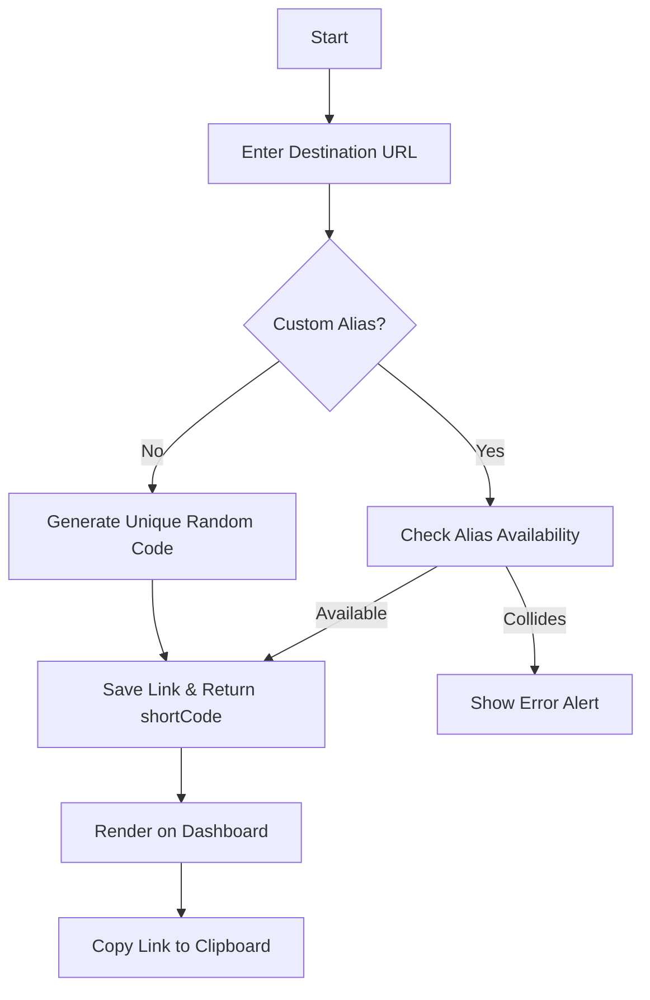

# Link Management Product Specification

## Purpose
This document defines the functional scope, validation rules, user flows, and acceptance criteria for **Milestone 3: Link Management** of the Shortly platform. It serves as the official product specification and blueprint for client-side and server-side developers.

---

## Problem Statement
Sharing raw URLs is problematic: they are visually cluttered, leak tracking parameters, degrade formatting in chat applications, and are impossible to read over phone or physical media. While commercial shorteners exist, they restrict essential capabilities—such as custom slug aliases, analytics dashboards, and links history management—behind expensive paywalls.

Shortly addresses this by providing a clean, open-source SaaS platform for generating, modifying, and sharing short codes securely.

---

## Project Goals
- Provide a developer-grade URL shortener with a custom-alias gateway.
- Ensure that active redirect routes resolve within milliseconds under minimal database load.
- Ensure the user interface is completely clean, free of mockup data, and displays clear empty-state components when records are missing.

---

## Business Objectives
1. **Developer Trust**: Deliver simple, predictable API endpoints with deterministic HTTP status responses.
2. **User Retention**: Enable fast, direct redirection routes without interstitial ads or redirection delay screens.
3. **Data Integrity**: Validate all destination targets using strict format checks to prevent malicious link injection.

---

## Functional Requirements
1. **Link Generation**: Users can submit an original URL and receive a unique short code slug.
2. **Custom Alias**: Users can request a custom slug string to represent their destination (e.g. `short.ly/resume`).
3. **Dashboard Table**: Users can view a dashboard listing all their created links.
4. **Copy Action**: Quick-copy buttons let users duplicate short URLs directly to their clipboards.
5. **Toggle Availability**: Users can activate or deactivate any short link instantly.
6. **Link Deletion**: Users can delete links, freeing up custom aliases and disabling the redirect routes permanently.
7. **Redirect Execution**: Navigating to `/:shortCode` triggers immediate database increments and redirects the client to the destination.

---

## Non-Functional Requirements
- **Performance**: Redirection paths must execute in `< 50ms` on average.
- **Reliability**: Custom aliases must guarantee absolute uniqueness to prevent destination hijack conflicts.
- **Security**: Link manipulation endpoints require valid JWT authentication.
- **Responsiveness**: The Dashboard link catalog table must adjust seamlessly to desktop, tablet, and mobile viewports.

---

## Version 1 Scope
- Shortening of validated HTTP/HTTPS URLs.
- Randomized 6-character short code generation.
- Custom alias submission, collision checks, and custom validation.
- User dashboard link manager (Listing, Deletion, Status toggling).
- Basic click count increments.

---

## Out of Scope (Version 1)
- Deep click telemetry analysis (referrer, browser, geographic breakdown).
- Dynamic QR Code PNG/SVG downloads.
- Custom domain mapping (e.g. `userdomain.com/slug`).
- Bulk CSV/JSON import or export of links.
- Interstitial warning screens ("You are leaving shortly...").

---

## User Stories

### Story 1: Fast Shortening
> **As an** authenticated user,  
> **I want to** submit a long link,  
> **So that** I can obtain a compact short code to share easily.

### Story 2: Custom Alias Branding
> **As a** developer or content creator,  
> **I want to** specify a custom alias for my shortened links,  
> **So that** my shared links look branded and memorable.

### Story 3: Dashboard Link Management
> **As an** active user,  
> **I want to** review my link list on a clean dashboard,  
> **So that** I can track how many clicks they have received, toggle their active state, or delete them.

### Story 4: Redirection Execution
> **As a** recipient of a shortly link,  
> **I want to** click the link and land on the destination immediately,  
> **So that** I do not wait through blank load screens or ad redirects.

---

## User Flow

---

## Validation Rules

### Destination URL
- **Format**: Must begin with `http://` or `https://` followed by a valid host address.
- **Null Target**: Cannot be empty or whitespace.

### Custom Alias
- **Alphanumerics Only**: Allowed characters are `a-z`, `A-Z`, `0-9`, and dashes `-`. Spaces or special characters are rejected.
- **Min Length**: 5 characters.
- **Max Length**: 20 characters.
- **Keywords**: Cannot use reserved platform paths (e.g., `login`, `register`, `dashboard`, `analytics`, `profile`, `api`, `health`).

---

## Error Handling Expectations
- **400 Bad Request**: Invalid URL formatting or slug values violating validation rules.
- **401 Unauthorized**: Missing, expired, or invalid JWT headers.
- **403 Forbidden**: Trying to edit or delete a link owned by another user, or redirecting via an inactive link.
- **404 Not Found**: Attempted redirection for a code that does not exist in the database.
- **409 Conflict**: Requested custom alias is already reserved by another link record.
- **500 Internal Server Error**: Database write failures or code generation retries limit hit.

---

## Security Requirements
- **Strict Authorization**: Every update, toggle, or delete request must check that the requesting `userId` (from the verified JWT payload) matches the `user` property stored in the target `Link` document.
- **Prevention of Phishing Targets**: In later phases, blacklist checks will run against the destination host.
- **Rate Limiting**: Apply request limits to `POST /api/links` to protect against link creation spam.

---

## Acceptance Criteria

### API Criteria
- Creating a link with a duplicate custom alias must fail with HTTP `409 Conflict`.
- Creating a link without an alias must generate a unique, non-overlapping slug.
- Redirections via `GET /:shortCode` must return HTTP `302 Found` with the `Location` header pointing to the destination URL.

### UI Criteria
- If a user has no links, the dashboard must display the `EmptyState` component with the CTA to create their first link.
- Clicking the active/inactive toggle on the dashboard must disable/enable redirects instantly without requiring a page refresh.
- Clicking copy on any link item must save the fully qualified short URL to the device clipboard and show success feedback.
